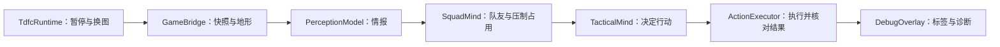

# TDFC 0.6.2 — 敌人战术与观察工具

敌人通过目击、听觉和同伴报告获取情报，再根据武器、处境、思维等级与阵营风格决定推进、搜索、避线、掩体、撤退和压制。伤害与血量沿用游戏本身；测试夹具中的高血量、固定压力只作用于独立测试窗口。

## 先用已有存档观察

双击 [Start-Test.bat](Start-Test.bat)。默认复制并载入原版最新自动存档；其他槽位也在测试窗口中可用。界面会显示实际载入的角色等级和地点，失败不改开新档。原存档不被覆盖。

测试启动、其他槽位、外部 `.sav` 和自动场景参数见 [build/README.md](build/README.md)。关闭旧测试窗口后再启动。重编译用 `build/build.ps1`，默认只生成候选文件；正常游戏加载的是 `release/TDFCMod.swf`。

## 观察界面

游戏右上角 `TDFC` 按钮打开/关闭观察。正常游玩默认关闭。

- 屏幕内敌人都有标签，包含特殊头目和未接管兵种的“原版接管”状态；隔墙标签颜色更淡，并标注“遮挡”。标签用于观察，抓取仍需将鼠标指向游戏内的对象。
- 点标签查看思维来源、情报年龄、行动原因、目标点、实际位移/发射信号、受阻原因。
- 目标连线随真实显示坐标变换；两条视野线只表示方向，不表示最终察觉范围。
- 面板可拖动。“保存诊断”输出角色、单位、坐标、行动、冷却等文本到该游戏窗口的数据目录；路径也写入 `tdfc.log`。
- 观察模式下，右键或默认 Q 操作后，“念力”行显示最近一次结果：已抓取、已释放、输入被拦截、魔力不足、目标不允许等。“保存诊断”也包含这次输入之前的目标与限制条件，便于排查；它只读状态，不替玩家抓取或绕过其他模组规则。
- 输入被拦截时，如已连接视野设置接口，会同时显示正在运行的视野模式；导出保留最近 12 次操作，点空白不会盖掉之前的失败。
- 敌人被念力抓取时显示“念力控制中”，TDFC 暂停移动和开火指令；释放后重新判断战术。地雷保持原版控制。
- 日志显示版本、加载/暂停/错误状态和持续心跳；单纯进入某个动作分支不会被描述为命中成功。

## 思维与风格

思维分粗放、熟练、战术、精锐四档。基础档为 `1 + floor(敌人等级 / 12)`，训练兵种 +1，精英/强化单位 +1，上限 4。原版 `hero` 的不同数字表示强化类型，同样加一档，不按数字当军衔。单位首次被记录时定档，不跟随玩家临时升级跳档。

更高档次缩短确认和报告延迟、延长信息记忆、增加掩体比较数量，更倾向选择能安全探头的掩体；仍需目击或有时效的情报。

| 阵营 | 主要偏好 |
|---|---|
| 掠夺者 | 接近有效射程、强攻，受伤较重才撤退，压制时间较短 |
| 铁骑卫 | 保持火力阵位、掩护同伴，压制窗口较长 |
| 雇佣兵 | 稳健选掩体与射击位置 |
| 奴隶贩子 | 机会进攻，推进意愿较高 |
| 斑马军团 | 推进与队友报告、射界分散相结合 |
| 英克雷 | 保持射程与机动射击，按飞行能力限制动作 |

`fraction` 只判断当前敌我，不用于阵营命名。特殊头目保留原版机制；未识别兵种也明确交回原版。本版不加入士气、溃逃和主动包抄。

## 开发入口

设计约定见 [design/refactor-v0.6.md](design/refactor-v0.6.md)，当前状态见 [state/MEMORY.md](state/MEMORY.md)。验证记录：[0.6 主线](knowledge/experiments/refactor-validation-2026-09-10.md)、[0.6.1 念力与输入](knowledge/experiments/telekinesis-validation-2026-09-12.md)。

2026-09-19 已修复并部署 RealisticVision 原版显示误拦念力的问题（v0.28.0-grabfix.1）。正式文件独立启动后，敌人/地雷的右键与 Q 抓取及基础遮挡检查通过；正常保存并重启游戏后生效。TDFC 0.6.2 同时提供实际视觉模式与最近操作诊断；若原目标仍失败，打开观察面板并保存诊断。证据见 [本次调查](knowledge/experiments/telekinesis-vision-validation-2026-09-19.md)。

掩体导航限于已检查的短程通路，不能代替原版完整的跨层寻路。战斗场景包含随机行为；自动结果不是所有关卡、头目或其他模组组合均已验收的证明。
